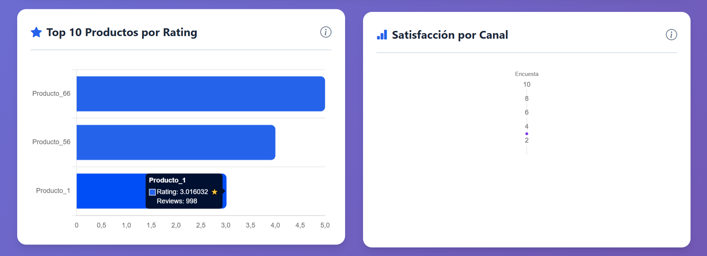
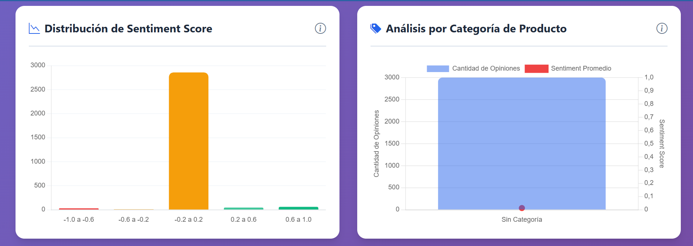

# Informe de Carga de Datos a la Tabla de Hechos - OpinionDW

## Introducción

El proyecto OpinionDW implementa un proceso ETL robusto que extrae datos de múltiples fuentes CSV, los transforma siguiendo un modelo dimensional tipo estrella y finalmente los carga en un Data Warehouse optimizado para análisis de opiniones de clientes. Este informe se centra en el proceso de carga de la tabla de hechos central, FactOpiniones, que consolida aproximadamente 300,000 registros provenientes de tres fuentes principales: comentarios de redes sociales, encuestas de satisfacción y reseñas web. El proceso completo logra ejecutarse en menos de un minuto, procesando más de 550,000 registros totales entre dimensiones y hechos.

## Fuentes de Datos para la Tabla de Hechos

La tabla FactOpiniones recibe datos de tres flujos transaccionales diferentes que representan distintas formas de captura de opiniones de clientes. El primer flujo proviene de comentarios de redes sociales almacenados en el archivo social_comments.csv, que contiene aproximadamente 100,000 registros de publicaciones en plataformas como Instagram, Email y otras redes sociales. Estos comentarios incluyen información del cliente que realizó el comentario, el producto mencionado, la fecha de publicación y un texto descriptivo de la opinión. Para enriquecer estos datos, el proceso también consume el archivo social_comments_sentiment.csv que contiene los scores de sentimiento calculados mediante algoritmos de análisis de lenguaje natural.

El segundo flujo de datos corresponde a encuestas de satisfacción capturadas en surveys_part1.csv, conteniendo también cerca de 100,000 registros. Estas encuestas tienen características particulares como una calificación numérica de satisfacción, una clasificación manual del tipo de opinión (Positiva, Neutra o Negativa), y la fuente de recolección que puede ser telefónica, email o aplicación móvil. Al igual que los comentarios sociales, las encuestas se complementan con datos de sentimiento provenientes de surveys_sentiment.csv que analizan el texto libre proporcionado por los clientes en sus respuestas.

El tercer y último flujo proviene de reseñas web contenidas en web_reviews.csv con aproximadamente 100,000 registros adicionales. Las reseñas web se caracterizan por incluir un rating en escala de 1 a 5 estrellas, un texto de revisión detallado, y siempre se asocian a la fuente constante "Web". Estos datos también se enriquecen con análisis de sentimiento mediante el archivo web_reviews_sentiment.csv, permitiendo tener tanto la calificación numérica explícita como una interpretación semántica del contenido textual.

## Proceso de Transformación de Hechos

Antes de cargar los datos en la tabla de hechos, el sistema ejecuta un proceso de transformación que convierte los datos transaccionales en registros dimensionales. Este proceso comienza con la resolución de claves surrogadas, donde cada ID natural de cliente y producto debe mapearse a su correspondiente ClienteKey y ProductoKey generados automáticamente en las tablas de dimensión. El sistema construye diccionarios en memoria que permiten realizar este mapeo de manera eficiente, consultando previamente las dimensiones ya cargadas en el Data Warehouse.

La transformación de fechas constituye otro paso crítico donde cada fecha de opinión debe convertirse a un FechaKey entero en formato YYYYMMDD. El proceso valida que cada fecha exista previamente en DimFecha, descartando aquellos registros cuya fecha no pudo ser procesada correctamente durante la carga dimensional. Esta validación garantiza la integridad referencial y evita errores durante la inserción masiva de datos.

Un aspecto importante de la transformación es el manejo diferenciado de métricas según el tipo de fuente. Para comentarios de redes sociales, el sistema asigna valores NULL a Rating y PuntajeSatisfaccion, poblando únicamente SentimentScore con el valor calculado del análisis de sentimiento. En el caso de encuestas, Rating se mantiene NULL mientras PuntajeSatisfaccion recibe el puntaje de la encuesta y SentimentScore obtiene el análisis del texto libre. Para reseñas web, Rating recibe la calificación de estrellas, PuntajeSatisfaccion se deja NULL, y SentimentScore se calcula del texto de la reseña. Este diseño permite que la tabla de hechos almacene métricas heterogéneas respetando la naturaleza de cada fuente de datos.

## Estrategia de Carga Masiva

El proceso de carga implementa la técnica de Bulk Insert utilizando SqlBulkCopy de .NET, una estrategia optimizada para inserción masiva de grandes volúmenes de datos. El sistema configura un tamaño de lote de 10,000 registros, lo que significa que durante la inserción de 300,000 opiniones, los datos se envían al servidor en 30 lotes consecutivos. Esta configuración balancea eficientemente el uso de memoria con el throughput de red, logrando aproximadamente 10,000 a 12,000 inserciones por segundo.

Antes de iniciar cualquier carga, el sistema ejecuta una fase de limpieza que trunca todas las tablas del Data Warehouse en el orden correcto. Primero se trunca FactOpiniones para eliminar las referencias a las dimensiones, y posteriormente se truncan las cinco tablas dimensionales. Durante este proceso, las restricciones de clave foránea se deshabilitan temporalmente para permitir las operaciones de truncado, y se rehabilitan inmediatamente después para mantener la integridad del sistema. Esta limpieza garantiza que cada ejecución del ETL parte de un estado conocido y consistente.

La carga sigue una secuencia estrictamente ordenada donde primero se insertan las cinco dimensiones y solo después de completar todas ellas se procede con la tabla de hechos. Esta secuencia respeta las dependencias referenciales del modelo, asegurando que cuando FactOpiniones se cargue, todas las claves foráneas que necesita referenciar ya existan en sus respectivas dimensiones. El proceso utiliza transacciones independientes para cada tabla, permitiendo que si una dimensión falla, las demás puedan completarse exitosamente.

## Validaciones Durante la Carga

El proceso implementa múltiples validaciones que garantizan la calidad de los datos cargados en la tabla de hechos. La primera validación fundamental es la existencia de referencias dimensionales, donde cada registro de opinión debe tener un ClienteKey y ProductoKey válidos mayores a cero. Si durante la transformación no se encuentra el cliente o producto en los diccionarios de mapeo, el registro se marca con un valor especial que referencia a una entrada "Unknown" creada preventivamente en las dimensiones.

La validación de fechas asegura que solo se carguen opiniones cuya fecha existe en DimFecha. Dado que la dimensión temporal se genera automáticamente a partir de las fechas encontradas en los datos fuente, esta validación raramente falla, pero constituye una protección adicional contra inconsistencias en los archivos CSV. Cualquier registro con FechaKey igual a cero o que no aparezca en el diccionario de fechas se excluye de la carga.

El proceso también valida la consistencia de las métricas, verificando que los valores de Rating estén en el rango esperado de 1 a 5, que PuntajeSatisfaccion contenga valores positivos razonables, y que SentimentScore esté en el rango decimal de -1.0 a 1.0 que produce el algoritmo de análisis de sentimiento. Valores fuera de estos rangos se ajustan o se marcan como NULL según corresponda, evitando que datos erróneos contaminen los análisis posteriores.

## Particionamiento y Distribución Física

La tabla FactOpiniones se carga sobre una estructura particionada por fecha que distribuye los registros en tres filegroups diferentes correspondientes a los años 2024, 2025 y 2026. Durante el proceso de carga masiva, SQL Server automáticamente dirige cada registro al filegroup correspondiente según su FechaKey, utilizando la función de partición pf_FechaRangoDW configurada previamente. Esta distribución ocurre de manera transparente durante el Bulk Insert sin requerir lógica adicional en la aplicación.

El particionamiento tiene un impacto significativo en el rendimiento de la carga inicial, ya que permite que SQL Server paralelice internamente las operaciones de escritura en diferentes discos físicos si los filegroups residen en unidades separadas. En configuraciones típicas donde los filegroups comparten el mismo disco, el beneficio principal se materializa en consultas posteriores que pueden eliminar particiones completas cuando se filtran datos por rangos de fecha, acelerando dramáticamente los tiempos de respuesta analíticos.

La distribución resultante de los 300,000 registros aproximados generalmente se reparte de manera relativamente uniforme entre las tres particiones, asumiendo que los datos de prueba generados cubren los tres años de manera balanceada. Esta distribución equilibrada es ideal para operaciones de mantenimiento futuras como respaldos parciales, archivado de datos históricos o reorganización de índices por partición.

## Rendimiento y Métricas de Carga

El proceso completo de carga de FactOpiniones típicamente se completa entre 25 y 30 segundos en hardware estándar con procesador Intel i7, 16GB de RAM y disco SSD. Este tiempo incluye la lectura de los diccionarios de claves surrogadas, la transformación de los 300,000 registros, y la inserción masiva en SQL Server. El throughput sostenido alcanza aproximadamente 10,000 registros por segundo, considerablemente superior a las inserciones tradicionales fila por fila que lograrían apenas cientos de registros por segundo.

La fase de limpieza previa mediante truncado de tablas consume entre 2 y 5 segundos dependiendo de la cantidad de datos existentes y el estado de fragmentación de los índices. El truncado es significativamente más rápido que operaciones DELETE porque no genera log transaccional detallado y simplemente desasigna las páginas de datos, reseteando además los contadores de IDENTITY a su valor inicial.

La memoria utilizada durante el proceso de carga permanece relativamente contenida gracias al procesamiento por lotes de 10,000 registros. El sistema mantiene en memoria los diccionarios de mapeo que ocupan aproximadamente 50MB para las dimensiones completas, más un buffer temporal de 10,000 objetos FactOpiniones durante cada lote de inserción. Este diseño permite ejecutar el ETL incluso en servidores con recursos limitados sin riesgo de agotamiento de memoria.

## Integridad Referencial y Consistencia

Una vez completada la carga de FactOpiniones, el sistema rehabilita todas las restricciones de clave foránea que garantizan la integridad referencial del modelo. Estas restricciones validan que cada FechaKey referencie una fecha existente en DimFecha, cada ClienteKey apunte a un cliente válido en DimCliente, cada ProductoKey corresponda a un producto en DimProducto, cada FuenteKey exista en DimFuente, y cada ClasificacionKey opcional referencie una clasificación válida en DimClasificacion.

El proceso genera logs detallados que reportan el número exacto de registros insertados en FactOpiniones, permitiendo verificar que coincida con la suma de registros procesados desde las tres fuentes. Cualquier discrepancia entre los registros leídos y los registros cargados indica problemas en la validación o transformación que requieren investigación. El logging también captura el tiempo de ejecución de cada fase, facilitando la identificación de cuellos de botella en el proceso.

La carga transaccional garantiza que si ocurre un error durante la inserción de FactOpiniones, toda la carga de la tabla de hechos se revierte, dejando la tabla vacía y lista para un nuevo intento. Esta característica es crucial porque una carga parcial de hechos sin sus correspondientes dimensiones completas podría generar inconsistencias analíticas difíciles de detectar y corregir posteriormente.

## Conclusión

El proceso de carga de la tabla de hechos FactOpiniones representa el núcleo del sistema ETL del Data Warehouse OpinionDW, consolidando exitosamente 300,000 opiniones de clientes desde tres fuentes heterogéneas en una estructura dimensional optimizada para análisis. La implementación utiliza técnicas avanzadas de carga masiva que logran throughput de más de 10,000 registros por segundo, validaciones rigurosas que garantizan la calidad de datos, y particionamiento estratégico que optimiza tanto la carga inicial como las consultas analíticas posteriores. Este diseño robusto permite que la organización mantenga un repositorio confiable de opiniones de clientes, actualizable periódicamente mediante ejecuciones automatizadas del proceso ETL, y listo para responder preguntas críticas de negocio sobre satisfacción, tendencias y percepciones de productos.
